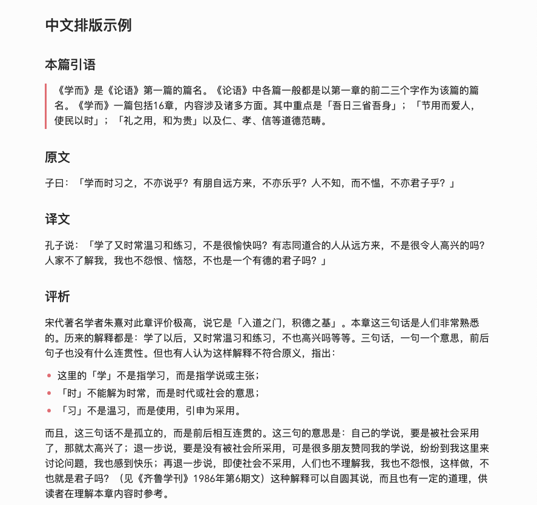
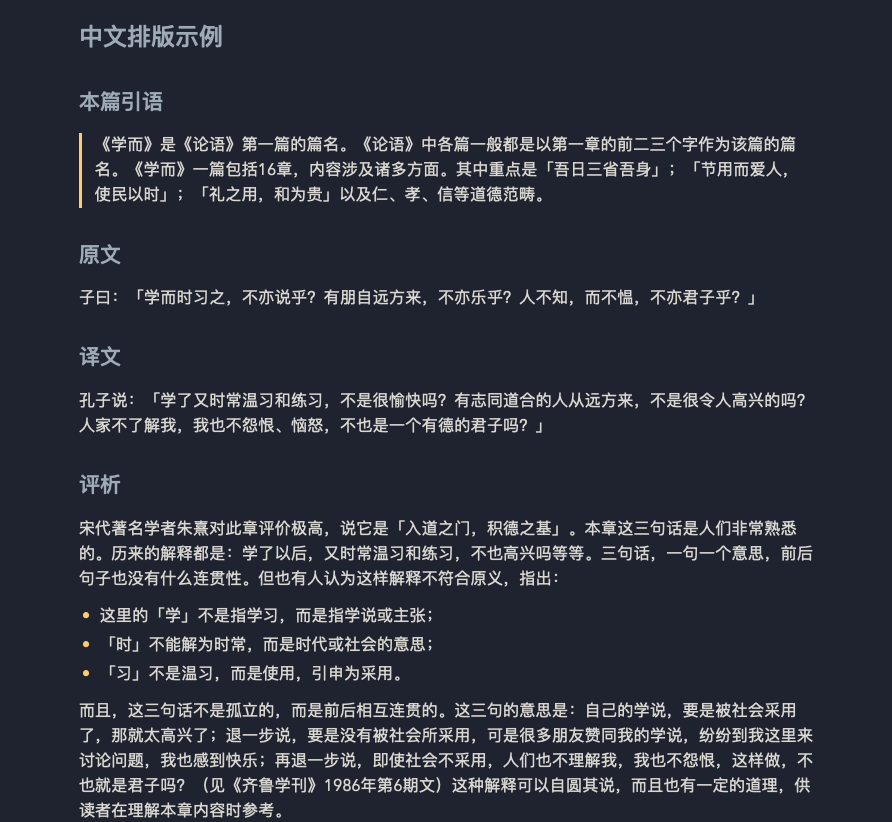
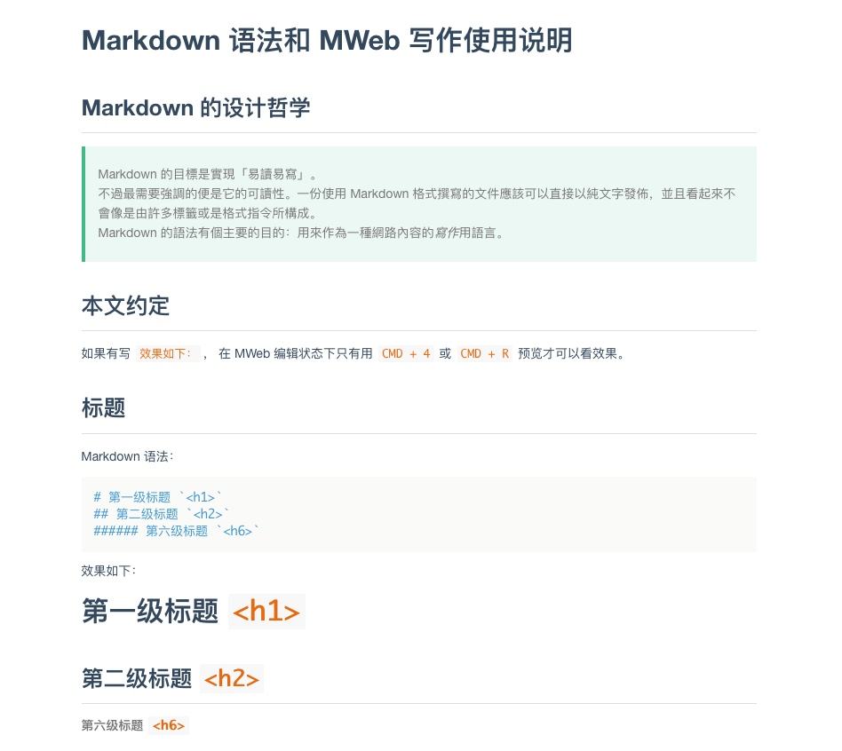
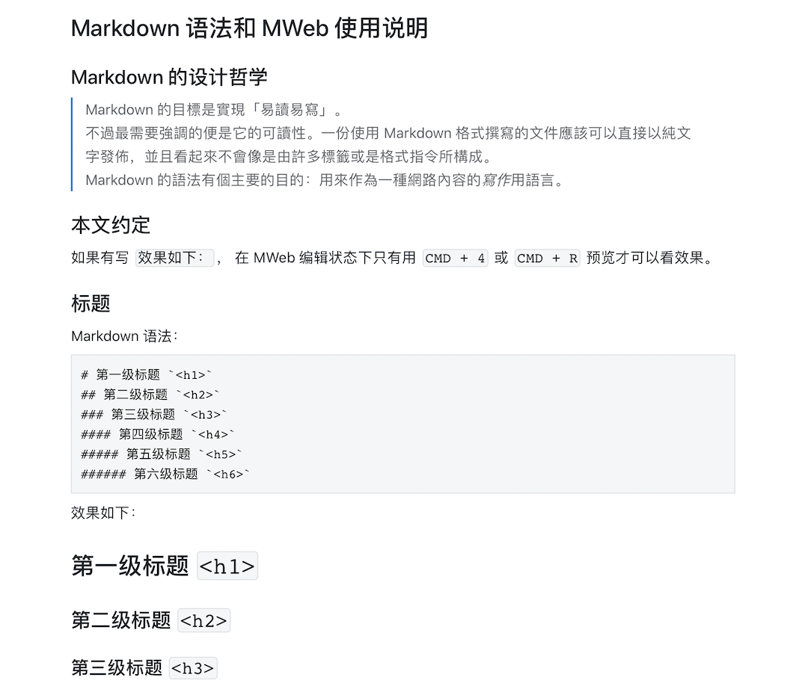
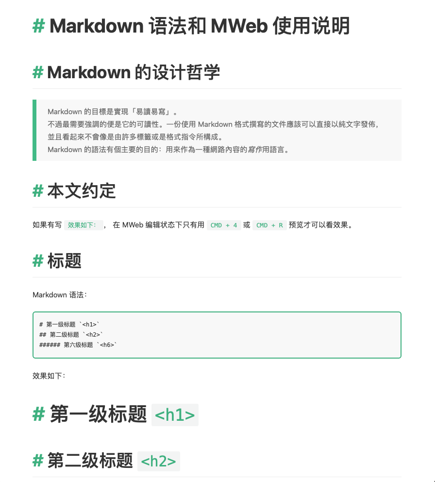

## MWeb-Themes

30+ 款 Markdown 预览主题，包括 [Typo.css](#typo)、[Vue](#vue)、[Bear](#bear-同款主题)、[Lark](#lark) 等风格，适用于 MWeb、Typora 等笔记软件。

[在线预览所有主题](https://imageslr.github.io/mweb-themes)

## 目录
- [主题列表](#主题列表)
  - [浅色主题](#浅色主题)
  - [深色主题](#深色主题)
  - [部分主题预览](#部分主题预览)
    - [Bear 同款主题](#bear-同款主题)
    - [Typo](#typo)
    - [Vue](#vue)
    - [Indigo](#indigo)
    - [Lark](#lark)
- [使用主题](#使用主题)
  - [在 MWeb 中使用](#在-mweb-中使用)
  - [在 Typora 中使用](#在-typora-中使用)
- [开发主题](#开发主题)

## 主题列表

### 浅色主题

```
ayu
bear-default
contrast
d-boring
default
duotone-heat
duotone-light
gandalf
indigo
jzman
lark
olive-dunk
red-graphite
smartblue
solarized-light
typo
v-green
vue
```

### 深色主题

```
ayu-mirage
charcoal
cobalt
dark-graphite
dieci
dracula
gotham
lighthouse
nord
panic
solarized-dark
toothpaste
```

### 部分主题预览

#### Bear 同款主题
灵感来自 [Bear](https://bear.app/cn/faq/Themes/About%20free%20and%20Pro%20themes%20in%20Bear/) 的主题，**共 22 款**。

> 默认配置：字号 16px、页宽 46rem。如果希望和 Bear 完全一致（字号 14px、页宽 40em），请自行更改 [bear-default.scss](src/themes/variables/bear-default.scss) 中的相关变量并重新编译。


<!-- ##### Red Graphite -->
<!--  -->

<!-- ##### Ayu Mirage
 -->

<!-- ##### Dark Graphite -->

<!--  -->
<!--  -->

#### Typo
基于 [Typo.css](https://github.com/sofish/Typo.css) 修改：

<!--  -->

#### Vue
基于 [typora-vue-theme](https://github.com/blinkfox/typora-vue-theme) 修改：

<!--  -->

#### Indigo
基于 [MDTU](https://markdown.devtool.tech/app) 修改：

<!-- 
 -->

#### Lark
灵感来自 [飞书文档](https://docs.feishu.cn/docs)：


<!-- ### SmartBlue

基于 [smartblue](https://github.com/cumt-robin/juejin-markdown-theme-smart-blue) 修改：

 -->

<!-- ### Jzman
基于 [jzman](https://github.com/jzmanu/juejin-markdown-theme-jzman) 修改：

 -->

<!-- ### V-Green
基于 [v-green](https://github.com/DawnLck/juejin-markdown-theme-v-green) 修改：

 -->


## 使用主题

### 在 MWeb 中使用

MWeb 3.x:
1. 下载 [release](https://github.com/imageslr/mweb-themes/releases) 页面最新的主题压缩包 `mweb3-themes.zip`
2. 打开 MWeb 偏好设置 - 预览样式 - 编辑 - 打开自定义样式所在的文件夹...（文件夹名为 `PreviewCSS`）
3. 将解压后的主题文件（.css 文件）拖到文件夹里
4. 点击 MWeb 偏好设置 - 预览样式 - 刷新，可以看到所有主题列表
5. 选择喜欢的主题

MWeb 4.0.x:
1. 下载 [release](https://github.com/imageslr/mweb-themes/releases) 页面最新的主题压缩包 `mweb3-themes.zip`
2. 解压，得到一系列名为 `mweb-xxx.css` 的文件
3. 打开 MWeb 偏好设置 - 自定义主题 - 新增亮主题 (如果是深色主题，应该选择“新增暗主题”)
4. 主题名称命名为 `mweb-xxx`
5. 出现一个主题编辑器，将右侧“按编辑器主题自动生成预览 CSS”取消勾选，然后将 `mweb-xxx.css` 文件的内容拷贝到右侧文本输入框中
6. 点击“保存”，随后就可以在偏好设置中切换亮/暗主题了

MWeb 4.2.x (Mweb Pro):
1. 下载与解压 `mweb4-themes.zip`
2. 打开 MWeb 偏好设置 - 主题&样式 - 自定义主题 - 导入亮主题 (如果是深色主题，应该选择“导入暗主题”) 
3. 选中第一步解压后得到的全部的 `mweb-xxx.mwebtheme` 文件，导入即可
4. 每个主题文件，均包含**编辑器主题**和**预览主题**

> Q: MWeb Pro 如何快速删除多个导入的主题文件？  
> A: 删除 `~/Library/Containers/com.coderforart.MWeb3/Data/Library/Application\ Support/themes` 中的文件夹即可。删除后需要重启 MWeb。

### 在 Typora 中使用

1. 下载 [release](https://github.com/imageslr/mweb-themes/releases) 页面最新的主题压缩包 `typora-themes.zip`
2. 打开 Typora 偏好设置 - 外观 - 打开主题文件夹
3. 将解压后的主题文件（.css 文件）拖到文件夹里
4. 重启 Typora
5. 点击菜单栏 - 主题，可以看到所有主题列表
6. 选择喜欢的主题

## 开发主题

本项目提供了一个标准样式模板，可以通过设置变量（颜色、字号等）的方式快速开发一个新的**预览主题**。

请查看[开发文档](develop.md)。